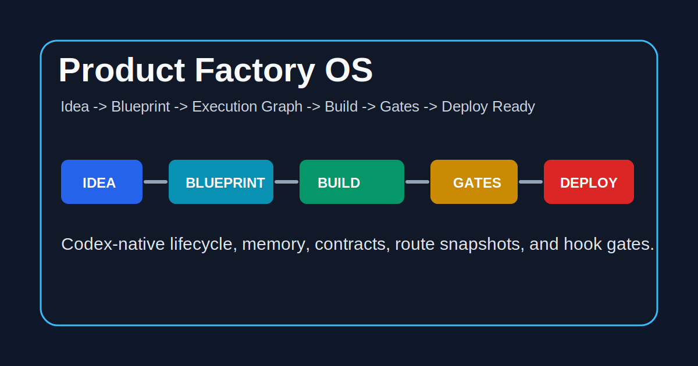

# Product Factory OS

> Deterministic product lifecycle runtime for Codex - from rough idea to deploy-ready product with gated planning, implementation, review, deployment preparation, and reloadable memory.

**Install in 30 seconds:**

```bash
git clone https://github.com/hihol-labs/product-factory-os.git
cd product-factory-os
bash install.sh
```

Then open any workspace project with Codex and describe what you want to build or fix. Product Factory OS routes the work automatically. [Full install guide](docs/INSTALL.md) | [Golden path](docs/examples/golden-path-booking-app) | [Skill contracts](docs/SKILL_CONTRACTS.md).

[](LICENSE)
[](#skills)
[](#agents)
[](.codex-plugin/plugin.json)
[](https://github.com/hihol-labs/product-factory-os/actions/workflows/validate.yml)
[](docs/PRODUCTION_READINESS.md)
[](.codex-plugin/plugin.json)

**[Russian version](README.ru.md)** | **[Changelog](CHANGELOG.md)** | **[Contributing](CONTRIBUTING.md)** | **[Methodology](docs/METHODOLOGY.md)** | **[Architecture](docs/PFO_ARCHITECTURE.md)**

> This repository is a **Codex plugin-style methodology runtime** (see `.codex-plugin/plugin.json`) plus an executable local CLI (`pfo`). It installs workspace defaults, hooks, skills, runtime contracts, and project memory. It is not a hosted platform.

## Demo

<p align="center">
  
</p>

---

## The Problem

Codex can write code, but product work drifts without a runtime:

- Product ideas turn into code before scope, users, and success criteria are explicit.
- Architecture, build plans, tests, and implementation often diverge.
- Browser checks, security reviews, dependency audits, hardening, and deploy evidence are easy to skip.
- Long projects lose context between sessions, role switches, and interrupted work.
- Existing repositories need adoption without overwriting local instructions.
- External tool state in GitHub, Linear, Notion, Google Drive, and Obsidian can drift from repository truth.

## The Solution

**Product Factory OS** turns Codex into a gated product factory: 32 skills, 15 specialist roles, runtime contracts, hooks, fixtures, validators, and CLI workflows that move work through a deterministic pipeline:

```text
IDEA -> DISCOVERY -> PRODUCT_BLUEPRINT -> BUILD_PLAN -> EXECUTION_GRAPH
     -> BUILD -> TEST -> REVIEW -> HARDEN -> DEPLOY_READY -> SAVE_STATE
```

Every major step has an artifact. Every risky transition has a gate. Every session can be resumed from `.codex-memory/STATE.json`. Execution policy, permissions, verification contracts, tool capabilities, structured events, and learning promotion gates are project-local artifacts, not chat-only instructions.

## Quick Start

### Installation

**Requirements:**

- Codex environment with local workspace access
- `git`, `bash`, and `python3`
- Linux, macOS, or WSL recommended

**Install Product Factory OS:**

```bash
git clone https://github.com/hihol-labs/product-factory-os.git
cd product-factory-os
bash install.sh
```

If the repository is not cloned inside your projects workspace, pass the workspace once:

```bash
bash install.sh --workspace ~/Projects
```

The installer validates PFO, installs the `pfo` command, installs hooks, writes workspace `AGENTS.md`, `CODEX.md`, and `PFO_WORKSPACE.json`, then adopts existing first-level projects without overwriting their local instructions.

**Verify the installation:**

```bash
python3 scripts/production_readiness.py
pfo metrics
```

See [docs/INSTALL.md](docs/INSTALL.md) for local development, hook policy, smoke prompts, and release checks.

### Usage

Start from natural language:

```text
I want to build a booking app for private tutors.
```

Product Factory OS routes it through `/project`:

- `A` Full cycle: discovery, blueprint, build, test, review, harden, deploy-ready state.
- `B` Planning only: product docs and execution graph, no code.
- `C` Existing docs: convert current docs into a Codex execution guide.

For existing codebases:

```text
Fix this checkout bug and add a regression test.
```

Product Factory OS routes it through `/task` to `/bugfix`, `/test`, `/review`, `/security-audit`, `/browser-check`, or another daily-work skill.

CLI entry points are available too:

```bash
pfo new my-product --idea "SaaS for subscription tracking"
pfo adopt ../existing-product --analyze --run-gates
pfo plan ../my-product
pfo review ../my-product
pfo validate ../my-product
pfo status ../my-product
pfo resume ../my-product
pfo export ../my-product --target obsidian
```

## How It Works

```text
You: "I want to build a tutor booking app"
         |
         v
    /project
         |
    asks: A, B, or C?
         |
    +----+-----------+-----------+
    v                v           v
 A) Full          B) Plan      C) Guide
 Cycle            Only         From Docs
    |                |           |
    v                v           v
 /kickstart      /blueprint    /guide
    |
    +-- /discover and optional /market-scan
    +-- Product classifier selects template modules
    +-- Product compiler writes blueprint, architecture, plan, graph
    +-- Review gate checks docs before build
    +-- Execution graph drives one build node at a time
    +-- /test, /browser-check, /review after changes
    +-- /security-audit, /deps-audit, /harden before release
    +-- /deploy only with explicit confirmation
    +-- /session-save preserves reloadable state
```

For existing repositories:

```text
/task -> adoption-check -> repository-analysis -> task-classification
      -> daily-work skill -> gates -> state-save
```

## End-to-End Example

A minimal Route A walkthrough:

```text
You:   I want to build a Telegram bot for paid fitness programs.
Codex: [/project] A, B, or C?
You:   A
Codex: [/kickstart] asks clarifying questions about users, payment,
       content delivery, admin flow, hosting, and budget.
You:   solo creator, Telegram payments, SQLite, VPS, launch this week.
Codex: writes DISCOVERY, PRODUCT_BLUEPRINT, PROJECT_ARCHITECTURE,
       BUILD_PLAN, EXECUTION_GRAPH, TEST_PLAN, QUALITY_GATES.
Codex: runs /review. Critical checks pass, warnings are listed.
You:   approve implementation.
Codex: builds node by node, runs tests and browser/API checks where relevant,
       records gate evidence, saves state, and prepares deploy readiness.
```

Reference fixtures live in [`tests/fixtures/`](tests/fixtures/). Route snapshots live in [`tests/snapshots/`](tests/snapshots/).

## Skills

### Entry Points

| Skill | Description |
|---|---|
| `/project` | Routes new product/project creation through Product Factory OS. |
| `/task` | Routes existing-code work to the correct daily-work skill. |
| `/adopt` | Onboards an existing repository into PFO with `AGENTS.md`, `CODEX.md`, memory, and `.pfo/` contracts. |

### Product, Strategy, And Planning

| Skill | Description |
|---|---|
| `/discover` | Turns an idea into market, user, scope, hypothesis, and validation notes. |
| `/market-scan` | Fresh public market and community signal scan for validation, ICP, competitors, launch, and roadmap decisions. |
| `/blueprint` | Planning-only workflow that compiles an idea into PFO product documents without implementation. |
| `/guide` | Converts existing project documents into a step-by-step Codex execution guide. |
| `/strategy` | Replans an existing product after context changes. |
| `/advisor` | Read-only advisory mode for product, architecture, and engineering decisions. |
| `/grill-me` | One-question-at-a-time stress test for plans, designs, architecture, strategy, and risky decisions. |

### Build And Quality

| Skill | Description |
|---|---|
| `/kickstart` | Full lifecycle from idea or approved docs to implemented, tested, reviewed, deployable project. |
| `/test` | Creates, repairs, or runs tests for changed behavior. |
| `/bugfix` | Reproduces, diagnoses, fixes, and regression-tests a bug. |
| `/refactor` | Improves structure while preserving behavior. |
| `/perf` | Measures and improves performance. |
| `/explain` | Explains code, architecture, or workflow without changing files. |
| `/doc` | Creates or updates project documentation in local style. |
| `/review` | Deterministic project review for docs, code, consistency, and readiness. |
| `/browser-check` | Local browser smoke testing with Playwright, Browser Use, or equivalent automation. |

### Security, Operations, And Release

| Skill | Description |
|---|---|
| `/security-audit` | Read-only security review for application and configuration risks. |
| `/deps-audit` | Read-only dependency, CVE, license, and maintenance audit. |
| `/harden` | Production readiness workflow for services before deployment. |
| `/infra` | Generates infrastructure-as-code and deployment configuration. |
| `/migrate` | Applies database or data migrations with backup and rollback notes. |
| `/deploy` | Deploys a reviewed service with explicit confirmation and verification. |

### Memory, Integrations, And Methodology

| Skill | Description |
|---|---|
| `/handoff` | Writes compact handoff artifacts for session, role, delegation, AFK, compaction, or recovery transfer. |
| `/session-save` | Saves PFO work context, state, decisions, blockers, and next steps. |
| `/mcp-docs` | Looks up fresh library, SDK, framework, and API documentation through MCP providers. |
| `/github-workflow` | Handles GitHub issues, PRs, CI, releases, review comments, changelogs, and publish state. |
| `/tool-sync` | Synchronizes PFO artifacts with Linear, Notion, Google Drive, GitHub payloads, or local exports. |
| `/obsidian-export` | Exports planning docs, memory, handoff, decisions, gates, and state to an Obsidian knowledge graph. |
| `/skill-create` | Creates or updates PFO skills with contracts, triggers, fixtures, snapshots, and validation gates. |

## Agents

Heavy or specialized work is assigned to focused roles:

| Agent | Used For | Specialization |
|---|---|---|
| `orchestrator` | Workflow control | State machine, execution graph, gates, next action. |
| `architect` | Blueprint and design | Database, API, auth, module boundaries, deployment topology. |
| `business-analyst` | Discovery and strategy | ICP, positioning, MVP scope, validation, GTM. |
| `researcher` | Market and technical research | Fresh docs, market signals, decision impact. |
| `backend-builder` | Server-side build | APIs, services, data models, jobs, integrations. |
| `frontend-builder` | UI build | Web apps, dashboards, forms, navigation, responsive UX. |
| `tester` | Test design | Unit, integration, regression, browser smoke evidence. |
| `reviewer` | Quality gates | Findings, spec compliance, code review, readiness status. |
| `security-reviewer` | Security | Auth, secrets, injection, uploads, dependency exposure, privacy. |
| `ux-reviewer` | Browser-facing UX | Visual hierarchy, layout, accessibility, interaction checks. |
| `data-reviewer` | Data policy | Migrations, analytics, retention, fake-vs-real data checks. |
| `operator` | Operations | Deploy, migrations, infra, rollback, runbooks. |
| `release-manager` | Release readiness | CI, changelog, version, rollback, accepted risks. |
| `integration-engineer` | External tools | GitHub, Linear, Notion, Google Drive, Obsidian, MCP sync. |
| `memory-agent` | Continuity | `.codex-memory/STATE.json`, memory notes, handoff state. |

## Skill Contracts

> In normal use, you do **not** need to invoke skills manually. Describe the task and PFO routes it. Contracts exist for debugging, contribution, and power users.

Every skill declares effort, side effects, explicit-invocation requirements, inputs, outputs, and idempotency. The canonical table is in [docs/SKILL_CONTRACTS.md](docs/SKILL_CONTRACTS.md).

Contract rules enforced by validators:

- High-impact production, migration, infrastructure, external-write, and deploy routes require explicit invocation.
- Read-only audits do not apply fixes unless remediation is requested.
- Skills that write artifacts must preserve existing files unless overwrite is approved or marker-based.
- Each skill must include self-validation.
- Skill changes must update triggers, fixtures, route snapshots, contracts, and validation coverage.

## Call Graph

PFO keeps workflow chains shallow and bounded:

```text
/project
  -> /kickstart
       -> /discover
       -> /market-scan
       -> /blueprint
       -> /mcp-docs
       -> /review
       -> /test
       -> /browser-check
       -> /security-audit
       -> /deps-audit
       -> /harden
       -> /deploy
       -> /handoff
       -> /github-workflow
       -> /tool-sync
       -> /obsidian-export
       -> /session-save
  -> /blueprint
  -> /guide

/task
  -> /bugfix, /refactor, /doc, /test, /perf, /review
  -> /security-audit, /deps-audit, /migrate, /harden, /infra, /deploy
  -> /mcp-docs, /browser-check, /github-workflow, /tool-sync
  -> /handoff, /obsidian-export, /session-save, /strategy, /advisor, /grill-me
```

Rules:

- No skill calls itself.
- Maximum planned depth is 3.
- Production-impacting paths require explicit confirmation.
- Product compiler stages are internal runtime stages, not user-invoked skills.

See [docs/CALL_GRAPH.md](docs/CALL_GRAPH.md).

## Workspace Hooks

`bash install.sh` installs hooks that make PFO the default methodology for the workspace:

| Hook | Purpose |
|---|---|
| `route-reminder.py` | Suggests `/project`, `/task`, or a specialized PFO skill. |
| `preflight-context.py` | Loads discovered docs, state, memory, and `.pfo/` contracts before work. |
| `session-diagnostics.py` | Reports stale state, recovery, handoff, and telemetry warnings. |
| `skill-completeness.py` | Checks skill changes against contracts, triggers, fixtures, and snapshots. |
| `commit-completeness.py` | Blocks incomplete methodology commits. |
| `review-before-commit.py` | Runs fast validators before methodology commits. |

Validate hooks with:

```bash
python3 scripts/validate_hooks.py
```

## Quality Gates

Every major project step should pass:

1. Requirements are documented.
2. Product classification and architecture template are explicit.
3. `PRODUCT_BLUEPRINT.md`, `BUILD_PLAN.md`, and `EXECUTION_GRAPH.md` agree.
4. Autonomous or delegated work has `.pfo/UNIT_CONTEXT_MANIFEST.json`.
5. Session, role, compaction, AFK, or recovery transfer has `HANDOFF.md`.
6. Behavior changes have TDD evidence or an explicit exception.
7. Bugfixes have root-cause evidence before the fix.
8. Verification is definitive; missing evidence creates recovery work.
9. Spec compliance review runs before code quality review.
10. Security, dependency, browser, hardening, and deploy gates are present when relevant.
11. `.pfo/` contracts do not report scope, data, fallback, golden-flow, or silent-substitution violations.
12. Session state is saved before stopping.

## What Gets Generated

### Route A: Full Cycle

Route A can produce:

- `DISCOVERY.md`, `IDEA_SCORECARD.md`, `VALIDATION_PLAN.md`
- `PRODUCT_BLUEPRINT.md`, `PROJECT_ARCHITECTURE.md`, `BUILD_PLAN.md`
- `EXECUTION_GRAPH.md`, `TEST_PLAN.md`, `QUALITY_GATES.md`
- `.pfo/` contracts and `.codex-memory/` state
- Working code, tests, browser/API smoke evidence, review reports, and deploy-readiness notes

### Route B: Planning Only

Route B writes product planning artifacts without implementation:

- scorecard, validation plan, feedback log, funnel model, asset register, content backlog
- blueprint, architecture, build plan, execution graph, test plan, quality gates
- optional handoff for later implementation

### Route C: Existing Docs

Route C reads existing planning docs and writes a Codex execution guide:

```text
CODEX_GUIDE.md
```

### Existing Project Adoption

`/adopt` or `pfo adopt` can create missing:

```text
AGENTS.md
CODEX.md
.codex-memory/MEMORY.md
.codex-memory/STATE.json
.pfo/
.pfo-starter.json
.github/workflows/validate.yml
justfile
```

## Runtime CLI

Product Factory OS includes an executable runtime:

```bash
pfo new my-product --idea "voice transcript or product idea"
pfo adopt ../existing-product --analyze --run-gates
pfo analyze ../existing-product --run-gates --report
pfo discuss ../my-product --phase phase-1 --note "API shape and fallback rules"
pfo plan ../my-product
pfo manifest ../my-product --unit N1 --goal "Primary booking flow"
pfo handoff ../my-product --from-role planner --to-role implementer --reason role-switch
pfo build ../my-product
pfo test ../my-product
pfo tdd-evidence ../my-product --red "pytest failed as expected" --green "pytest passed"
pfo root-cause ../my-product --summary "bad value enters parser" --evidence "trace shows parser input"
pfo verify-work ../my-product --evidence "tests and smoke passed" --pass-gate
pfo review-stage ../my-product --stage spec --status PASSED --evidence "matches manifest"
pfo review-stage ../my-product --stage quality --status PASSED --evidence "tests and review clean"
pfo review ../my-product
pfo validate ../my-product
pfo status ../my-product
pfo resume ../my-product
pfo report ../my-product
pfo finish-branch ../my-product --mode pr --verification "checks passed" --pr-url "https://github.com/..."
pfo brief ../my-product --mode recap
pfo learnings ../my-product --lesson "Keep provider fallback explicit"
pfo improve ../my-product --from-learnings --propose
pfo learning-gate ../my-product --require-approved
pfo permission-check ../my-product --capability write --path .codex-memory/STATE.json
pfo event validate ../my-product
pfo tool-registry ../my-product
pfo metrics
pfo export ../my-product --target github
pfo export ../my-product --target google-drive
pfo export ../my-product --target obsidian
```

Starter packs live in [`starters/`](starters/). Golden paths live in [`golden-paths/`](golden-paths/) and [`docs/examples/`](docs/examples/).

PFO uses `PFO Default Stack v1` as the golden path for new products: Python/FastAPI/Pydantic, PostgreSQL, Vue/TypeScript/Vite/TailwindCSS, Redis, S3-compatible storage, `just`, Docker, and Nginx. It is a default preset, not a hard lock; deviations must be recorded in `PROJECT_ARCHITECTURE.md` with reason, risk, support cost, and verification impact.

## Runtime Contracts

PFO runtime behavior is defined in repository contracts:

```text
core/product-compiler.md          Idea -> blueprint -> plan -> graph
routing/product-classifier.json   Product type classification
templates/product-templates.json  Reusable module sets
execution/state-machine.json      Valid workflow transitions
pipelines/execution-pipeline.json Required stages and artifacts
memory/session-state.schema.json  Reloadable state schema
memory/events.schema.json         Structured event log schema
deployment/deployment-targets.json Deploy-readiness checks
interface/                        Voice-first input/output contract
.pfo/                             Project-level invariants
```

`.pfo/` project contracts cover scope lock, data authenticity, golden flows, regression contracts, fallback policy, diff risk, and no silent substitution.

## Integrations

Connector-aware workflows are documented in [docs/OPENAI_MCP_INTEGRATIONS.md](docs/OPENAI_MCP_INTEGRATIONS.md).

Use:

- `/mcp-docs` for Context7 and fresh library/framework docs.
- `/browser-check` for local UI smoke tests.
- `/github-workflow` for PRs, issues, CI, release notes, and publishing state.
- `/tool-sync` for Linear, Notion, Google Drive, and export payloads.
- `/obsidian-export` for local knowledge graph export.

## Open Core And Commercial Extensions

Product Factory OS uses an open-core model:

- Open source: local runtime, basic starters, validators, skills, agents, hooks, fixtures, and methodology.
- Commercial extension space: premium starter packs, hosted dashboard, team workspaces, managed execution, enterprise policy, and implementation services.

Products generated with PFO belong to their authors. Using PFO does not require generated products to be open source.

See [docs/OPEN_CORE.md](docs/OPEN_CORE.md), [docs/COMMERCIAL.md](docs/COMMERCIAL.md), [docs/PRICING.md](docs/PRICING.md), and [docs/PACKS.md](docs/PACKS.md).

## Project Types

Works with typical software products:

- SaaS platforms
- Telegram, Discord, and other bots
- REST APIs and integration services
- Web apps, dashboards, and landing pages
- CLI tools and internal automation
- Mini apps
- E-commerce products
- Scrapers and data pipelines

## Who Is This For

| Audience | Value |
|---|---|
| Solo builders | Turn rough ideas into scoped, testable, resumable implementation plans. |
| Freelancers | Standardize delivery quality and handoff artifacts across client projects. |
| Startups | Move from MVP idea to deploy-ready build with explicit gates and evidence. |
| Agencies | Keep teams aligned around repeatable methodology, review, and release rules. |
| Codex power users | Add deterministic routing, memory, hooks, and validation to daily work. |

## What This Does NOT Do

- It does not replace senior architecture, security, legal, or compliance review for regulated products.
- It does not silently deploy, migrate, or mutate production infrastructure. Production-impacting operations require explicit confirmation.
- It does not invent production data, fake provider responses, or replace unavailable real sources without an approved fallback.
- It does not guarantee that every generated product is production-ready. It provides gates and evidence requirements that must be satisfied.
- It is not a hosted team platform yet. Hosted dashboards, managed execution, team workspaces, and enterprise policy belong to the roadmap.

## Validation

Production readiness gate:

```bash
python3 scripts/production_readiness.py
```

Core validators:

```bash
python3 scripts/validate_structure.py
python3 scripts/validate_plan_quality.py /path/to/project
python3 scripts/run_fixtures.py
python3 scripts/verify_triggers.py
python3 scripts/verify_fixture_contracts.py
python3 scripts/run_headless_fixtures.py --mode mock
python3 scripts/verify_skill_profiles.py
python3 scripts/validate_execution_graph.py
python3 scripts/validate_runtime.py
python3 scripts/validate_hooks.py
python3 scripts/verify_manifest_drift.py
python3 scripts/verify_install_sync.py
python3 scripts/run_benchmarks.py
python3 scripts/meta_review.py
```

## Repository Layout

```text
.codex-plugin/plugin.json   Codex plugin manifest
skills/                     Methodology skills
agents/                     Specialist role prompts
docs/                       Methodology docs, contracts, rubrics, install guide
core/                       Product compiler and runtime responsibilities
routing/                    Product classifier
templates/                  Product template library
pipelines/                  Execution pipeline contract
execution/                  State machine contract
memory/                     Reloadable session-state schema
deployment/                 Deployment abstraction layer
interface/                  Voice-first interface contract
hooks/                      Hook contracts and enforcement helpers
scripts/                    Validation and runtime CLI scripts
tests/fixtures/             Reproducible route fixtures
tests/snapshots/            Machine-readable route snapshots
starters/                   Starter packs for generated projects
dashboard/                  Static dashboard shell
integrations/               GitHub, Linear, Notion, Google Drive, Obsidian, MCP contracts
```

## Troubleshooting / FAQ

**Codex did not pick the expected skill.**

Run the route reminder locally and add a fixture if the route should be recognized:

```bash
python3 hooks/route-reminder.py "your prompt"
```

**`pfo validate` says planning files are missing.**

Run:

```bash
pfo plan <project>
pfo validate <project>
```

Then fill or approve generated TBD fields.

**A hook blocks a commit.**

Run:

```bash
python3 hooks/review-before-commit.py --full
```

Update the supporting docs, snapshots, fixtures, contracts, or changelog named by the hook.

**How do I save and resume context?**

Use `/session-save` or:

```bash
pfo status <project>
pfo resume <project>
```

State is stored under `.codex-memory/`.

**How do I export to Obsidian?**

Run:

```bash
pfo export <project> --target obsidian
```

The generated knowledge graph is written under `.pfo-integrations/obsidian/`.

## Contributing

Contributions are welcome. Keep methodology changes complete:

1. Update or add the skill under `skills/<name>/SKILL.md`.
2. Update contracts in `docs/SKILL_CONTRACTS.md`.
3. Update triggers in `docs/TRIGGERS.md`.
4. Add or update fixtures and snapshots.
5. Run the validation suite.
6. Keep `README.md` and `README.ru.md` aligned when public behavior changes.

See [CONTRIBUTING.md](CONTRIBUTING.md).

## Requirements

- Codex workspace with local file access
- `git`
- `bash`
- `python3`

## Changelog

See [CHANGELOG.md](CHANGELOG.md). This project follows Semantic Versioning and Keep a Changelog style.

## License

MIT

## Author

**hihol-labs** - [GitHub](https://github.com/hihol-labs)
